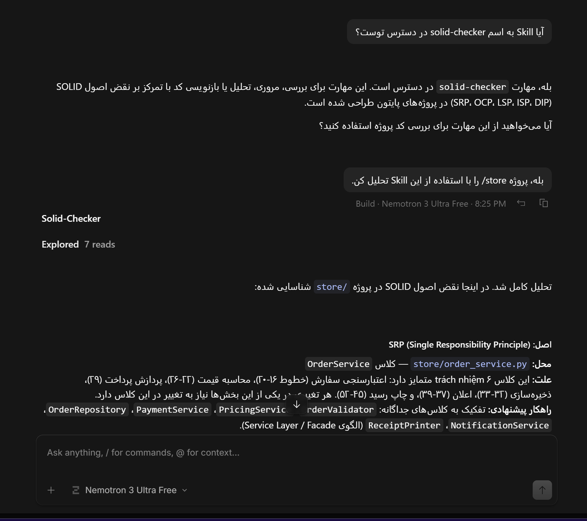
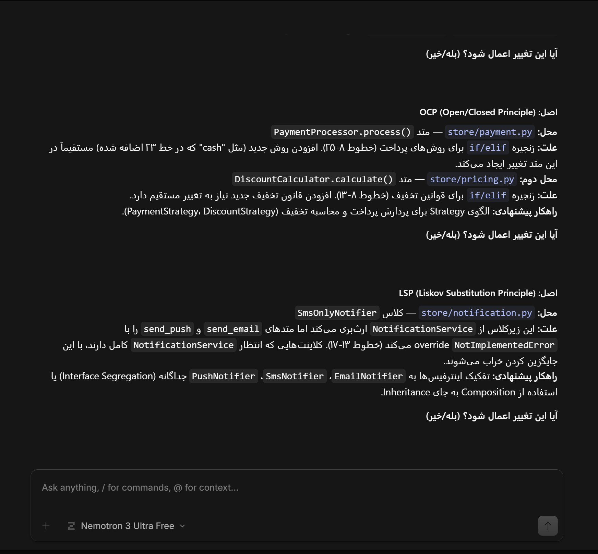
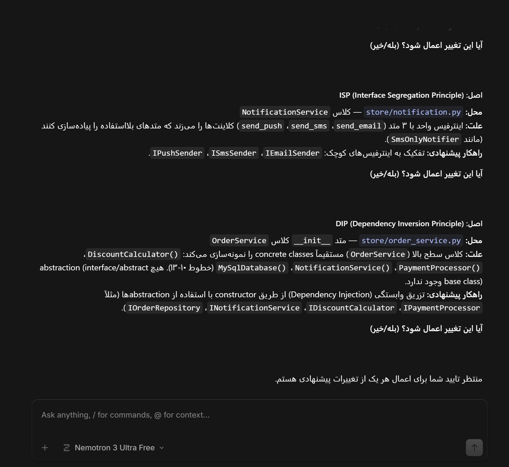

# گزارش آزمایش ۲ — مروری بر اصول طراحی شی‌گرا

## گام ۱: افزودن قابلیت جدید به نسخه اولیه (بدون اصلاح اصول SOLID)

قابلیت «روش پرداخت نقدی (Cash Payment)» با استفاده از OpenCode (مدل Nemotron 3 Ultra Free)
به نسخه اولیه پروژه اضافه شد. این نسخه در فولدر `01-OOD-Principles-Without` نگهداری می‌شود.

### جدول تغییرات

| ردیف | فایل/کلاس تغییر یافته | نوع تغییر | توضیح تغییر |
|---|---|---|---|
| ۱ | `store/payment.py` → `PaymentProcessor.process()` | افزودن شاخه `elif` جدید | برای پشتیبانی از روش پرداخت نقدی؛ چون منطق انتخاب روش پرداخت به‌صورت زنجیره if/elif پیاده شده، تنها راه افزودن روش جدید، افزودن یک شاخه‌ی دیگر به همین زنجیره است |
| ۲ | `store/main.py` → `build_demo_orders()` | افزودن یک `Order` جدید (`cash_order`) | برای نمایش و تست عملی قابلیت جدید در سناریوی دمو |
| ۳ | `store/main.py` → `main()` | تغییر خط unpacking + افزودن فراخوانی `process_order` | چون خروجی `build_demo_orders()` یک آیتم بیشتر شده، امضای تابع فراخوان هم باید هماهنگ شود |

### چرا این تغییرات ضروری بودند؟

از آنجا که `PaymentProcessor` به‌جای یک الگوی طراحی مثل Strategy، از یک زنجیره‌ی
`if/elif` برای انتخاب روش پرداخت استفاده کرده، تنها راه افزودن روش جدید، تغییر
مستقیم در بدنه‌ی همان کلاس بود. این کلاس هیچ نقطه‌ی توسعه‌ای (extension point)
بدون تغییر کد موجود ندارد — دقیقاً نمونه‌ای از نقض اصل Open/Closed (OCP) که در
گام ۲ به آن پرداخته می‌شود.

### استفاده از OpenCode در این گام
- **مدل مورد استفاده:** Nemotron 3 Ultra Free (رایگان)
- **ابزار:** OpenCode، با دستور `/init` برای ساخت خودکار `AGENTS.md` و سپس حالت Build برای اعمال تغییرات
- خروجی پیشنهادی Agent قبل از اعمال بررسی شد و با کد واقعی مطابقت داده شد؛ نیازی به اصلاح دستی نبود.

## گام ۲: تحلیل اصول طراحی SOLID

### SRP (Single Responsibility Principle)
رعایت شده؟ خیر
محل در پروژه: order_service.py → OrderService.process_order()
توضیح: این متد به‌تنهایی ۶ مسئولیت مجزا دارد: اعتبارسنجی سفارش، محاسبه
قیمت/تخفیف، پردازش پرداخت، ذخیره‌سازی در دیتابیس، اطلاع‌رسانی (ایمیل+پیامک)،
و چاپ رسید. هر تغییر در هرکدام از این حوزه‌ها (مثلاً تغییر فرمت رسید) باعث
تغییر همین کلاس می‌شود.

علت نقض: ترکیب چند مسئولیت مستقل در یک متد واحد.
روش اصلاح: استخراج هر مسئولیت به یک کلاس/سرویس جداگانه (مثلاً
OrderValidator, ReceiptPrinter) و فراخوانی آن‌ها از OrderService که
صرفاً نقش هماهنگ‌کننده (orchestrator) را ایفا کند.
دلیل انتخاب: این کار باعث می‌شود تغییر در هر بخش (مثلاً فرمت رسید) بدون
نیاز به لمس منطق پرداخت یا اعتبارسنجی ممکن شود و تست‌پذیری هر بخش بالا برود.

---

### OCP (Open/Closed Principle)
رعایت شده؟ خیر
محل در پروژه: payment.py → PaymentProcessor.process()
توضیح: افزودن هر روش پرداخت جدید (مثل «cash» که در گام ۱ اضافه کردیم)
نیازمند ویرایش مستقیم بدنه‌ی این کلاس است (افزودن شاخه‌ی elif جدید). کلاس در
برابر توسعه باز نیست.

علت نقض: استفاده از زنجیره‌ی if/elif به‌جای یک الگوی توسعه‌پذیر.
روش اصلاح: استفاده از الگوی Strategy: تعریف یک اینترفیس/کلاس پایه‌ی
انتزاعی (مثلاً PaymentMethod) با پیاده‌سازی جداگانه برای هر روش پرداخت
(CreditCardPayment, PayPalPayment, CashPayment, ...).
دلیل انتخاب: با این روش، افزودن روش پرداخت جدید فقط نیازمند افزودن یک
کلاس جدید است، بدون تغییر در کد موجود PaymentProcessor.

---

### DIP (Dependency Inversion Principle)
رعایت شده؟ خیر
محل در پروژه: order_service.py → OrderService.__init__()
توضیح: این کلاس مستقیماً وابسته به پیاده‌سازی‌های concrete است:
DiscountCalculator(), PaymentProcessor(), NotificationService(),
MySqlDatabase() — نه به یک abstraction. ماژول سطح بالا مستقیماً به جزئیات
ماژول‌های سطح پایین وابسته است.

علت نقض: نبود لایه‌ی انتزاعی (interface) بین OrderService و وابستگی‌هایش.
روش اصلاح: تعریف اینترفیس‌هایی مثل IPaymentProcessor, IDatabase,
INotificationService و تزریق وابستگی (Dependency Injection) از طریق
constructor به‌جای ساختن مستقیم نمونه‌ها داخل OrderService.
دلیل انتخاب: این کار امکان تعویض پیاده‌سازی‌ها (مثلاً تعویض MySQL با
دیتابیس دیگر، یا mock کردن برای تست) را بدون تغییر در OrderService فراهم
می‌کند.

### LSP (Liskov Substitution Principle)
**رعایت شده؟** خیر
**محل در پروژه:** `notification.py` → `SmsOnlyNotifier(NotificationService)`
**توضیح:** این زیرکلاس، متدهای `send_email` و `send_push` را با پرتاب
`NotImplementedError` غیرفعال می‌کند. اگر کدی با تایپ `NotificationService`
کار کند و این زیرکلاس را جایگزین آن کند، رفتار برنامه می‌شکند.

**علت نقض:** زیرکلاس نمی‌تواند بدون تغییر رفتار قابل مشاهده، جایگزین کلاس
پایه شود.
**روش اصلاح:** به‌جای ارث‌بری از یک کلاس با متدهای اجباری‌شده، هر کانال
اطلاع‌رسانی (Email, SMS, Push) را به‌صورت اینترفیس‌های مجزا تعریف کنیم و
`SmsOnlyNotifier` فقط اینترفیس مربوط به SMS را پیاده‌سازی کند.
**دلیل انتخاب:** این کار مستقیماً به حل ISP هم کمک می‌کند و از پرتاب استثنا
برای متدهای «پشتیبانی‌نشده» جلوگیری می‌کند.

---

### ISP (Interface Segregation Principle)
**رعایت شده؟** خیر
**محل در پروژه:** `notification.py` → کلاس `NotificationService`
**توضیح:** این کلاس یک اینترفیس/کانترکت «فربه» دارد (email + sms + push با
هم). کلاینت‌هایی که فقط به یک کانال نیاز دارند (مثل `SmsOnlyNotifier`)
مجبورند به متدهایی وابسته باشند که نمی‌خواهند و نمی‌توانند پیاده کنند.

**علت نقض:** یک اینترفیس بزرگ به‌جای چند اینترفیس کوچک و تخصصی.
**روش اصلاح:** تفکیک `NotificationService` به اینترفیس‌های کوچک‌تر مثل
`EmailNotifier`, `SmsNotifier`, `PushNotifier`، و ترکیب آن‌ها فقط در جایی که
واقعاً نیاز است (مثلاً یک `MultiChannelNotifier` که همه را دارد).
**دلیل انتخاب:** این کار باعث می‌شود کلاس‌هایی مثل `SmsOnlyNotifier` فقط به
همان اینترفیسی وابسته باشند که واقعاً استفاده می‌کنند، بدون نیاز به override
کردن متدهای اضافی با استثنا.

### نحوه تقسیم‌کار در تحلیل SOLID
برای تحلیل موازی، هر یک از اعضای گروه سه/دو اصل را جداگانه روی یک برنچ
مجزا بررسی کردند:
- سارا: تحلیل SRP، OCP، DIP (روی برنچ analysis/solid-srp-ocp-dip)
- زهرا : تحلیل LSP، ISP (روی برنچ analysis/solid-lsp-isp)

سپس دو برنچ در feature/analyze-code merge شدند و نتیجه‌ی نهایی در جدول
زیر یکپارچه شد.

## گام ۳: طراحی Skill برای OpenCode

یک Skill سفارشی به نام `solid-checker` در مسیر
`.opencode/skills/solid-checker/SKILL.md` طراحی و اضافه شد.

### هدف Skill
شناسایی نقض هر یک از پنج اصل SOLID در کد پایتون پروژه، ارائه‌ی دلیل مبتنی
بر کد واقعی برای هر نقض، پیشنهاد یک راهکار Refactoring مشخص، و اعمال
تغییرات فقط پس از تایید صریح کاربر.

### اطلاعاتی که در اختیار Agent قرار می‌گیرد
- معیارهای دقیق تشخیص هر یک از ۵ اصل (SRP, OCP, LSP, ISP, DIP) به‌صورت
  پرسش‌های راهنما
- یک قالب خروجی ثابت (اصل / محل / علت / راهکار پیشنهادی) برای یکدست بودن
  گزارش‌ها
- قید صریح: هرگز بدون تایید کاربر تغییری اعمال نشود

### چرا این ساختار انتخاب شد
استفاده از فرمت رسمی Skill در OpenCode (`SKILL.md` با YAML frontmatter شامل
`name` و `description`) به‌جای پرامپت یک‌بارمصرف، باعث می‌شود این تحلیل در
هر session جدید و برای پروژه‌های مشابه قابل استفاده‌ی مجدد باشد.

### مشکل فنی حین ساخت (و رفع آن)
هنگام ساخت اولیه‌ی فایل با ویرایشگر متن، یک کاراکتر بک‌اسلش اضافه قبل از
خط `---` ابتدای فایل درج شده بود که باعث می‌شد OpenCode نتواند YAML
frontmatter را تشخیص دهد (پیام: "There's no solid-checker skill
installed"). با بازنویسی فایل به‌صورت UTF-8 بدون BOM از طریق PowerShell،
مشکل رفع و Skill به‌درستی شناسایی شد.

### خروجی Skill روی پروژه
Skill با موفقیت تمام ۵ نقض شناسایی‌شده در گام ۲ را تشخیص داد، و حتی یک
مورد اضافه یافت: نقض OCP در `pricing.py` (زنجیره if/elif در
`DiscountCalculator.calculate()`) که در تحلیل دستی گام ۲ ذکر نشده بود.

### نکته‌ی ارزیابی
در خروجی، عبارت ویتنامی «trách nhiệm» به‌جای کلمه‌ی «مسئولیت» درج شده بود —
نمونه‌ای از خطای زبانی مدل رایگان (Nemotron 3 Ultra Free) که نیاز به بازبینی
انسانی داشت.